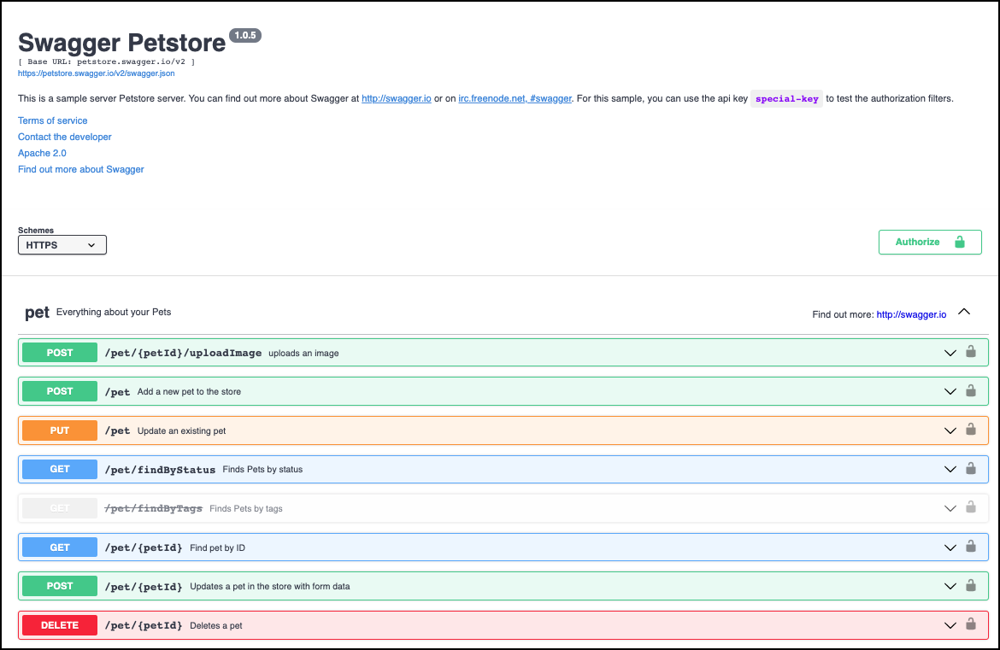
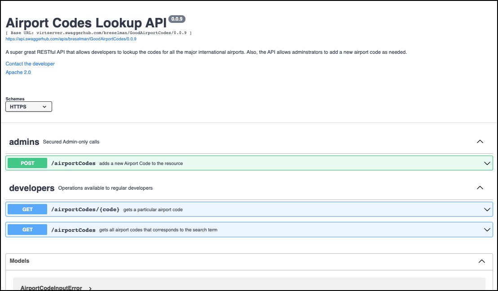

#Integrating `swagger-ui` with Gatsby.

The purpose of this project is to demonstrate how to integrate the [`swagger-ui` NPM](https://www.npmjs.com/package/swagger-ui) package to render Swagger/Open API specs in Gatsby.

This project binds to the PetStore API.

## Assumptions

This project assumes the following:

* You have [Node.JS installed](https://nodejs.dev/learn/how-to-install-nodejs) installed on your computer system.
* You have [Yarn installed](https://classic.yarnpkg.com/en/docs/install) on your development computer
* You have the [Gatsby CI tool installed](https://www.gatsbyjs.com/docs/tutorial/part-0/) on your development computer.


## Installing the project

Execute the following command:

`yarn install`

## Running the project

Execute the following command:

`gatsby develop`

Then, run the following URL in your browser:

`http://localhost:8000`

So see how the PetStore API is bound to the project, look at the page, [`./src/pages/index.js`](./src/pages/index.js).



If you want to experiment with importing an external Swagger/OpenAPI Spec from another source, substitute this code into `/src/pages/index.js`.

```
import React, { useEffect, useRef } from "react";

// markup
const IndexPage = () => {
  const swaggerRef = useRef(null);

  useEffect(() => {
    window.SwaggerUI({
      domNode: swaggerRef.current,
      url: "https://api.swaggerhub.com/apis/breselman/GoodAirportCodes/0.0.9",
    });
  }, []);

  return <div ref={swaggerRef} id="swaggerWrapper" />;
};

export default IndexPage;


```

You'll get output similar to the following:



## Credits

* **Developer:** [Eric Kiilu](https://github.com/ekiilu).
* **Documentation:** Bob Reselman


